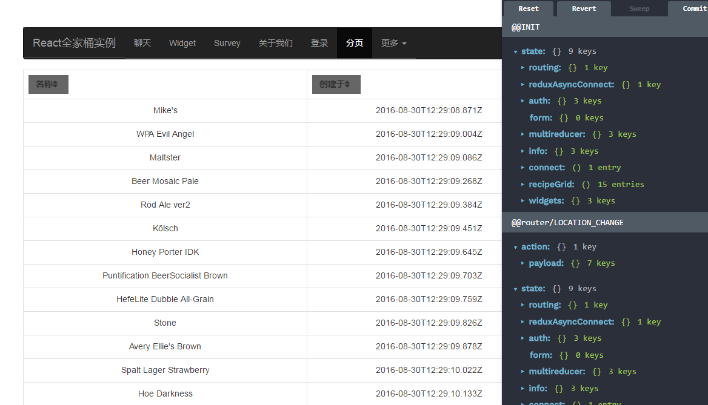
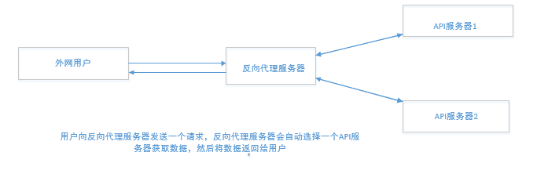

### 写在前面的话
自已以前对redux,react,rect-redux,react-router都是有一点的了解，并且在真实的项目中也多少有些涉及。但是不足的地方在于没有做一个demo将他们串起来,所以总是感觉似懂非懂。特别是react服务端渲染这一块，对于自己完全就是一个黑箱，这对我深入理解react同构等稍微难一点的内容产生了很大的影响。所以我最后写了这个例子，希望有同样困扰的同学能够有所收获。也欢迎star,issue。

不得不说，当你真实的去做一个项目的时候，哪怕是一个小小的demo，这都会完全颠覆你对React生态的认识。从一开始的不知道如何入手，到遇到各种困难，然后各种google，最后解决问题，你会发现自己是真的在成长。遇到的问题以及解决方案，我在文章列表中也给出了。时间+经历=成长，对于我来说就够了。默默的对自己说一句，加油把少年!

### 1.windows／mac启动项目说明
克隆该项目，然后直接运行就可以了。开发模式下运行:
```js
git clone https://github.com/liangklfangl/react-universal-bucket.git
npm install concurrently -g
npm install better-npm-run -g
//如果在mac上需要启动sudo权限,同时在这一步，如果是首次在mac下运行该项目，要执行npm rebuild node-sass
npm run dev
//mac下启动sudo
```
打开http://localhost:3222/ 就可以看到效果。项目截图如下：



如果是生产环境下，运行下面的命令即可(首先删除webpack-assets.json，重新生成):
```js
git clone https://github.com/liangklfangl/react-universal-bucket.git
npm run build
//这一步必须执行，否则一直输出[webpack-isomorphic-tools] (waiting for the first Webpack build to finish)
npm run pro
```

### 2.项目基本知识点
#### 2.1 代理与反代理的基本内容
使用http-proxy来完成。其反向代理的原理如下图：



通过如下代码完成，其相当于一个反向代理服务器，向我们的代理服务器，即API服务器发送请求:
```js
const targetUrl = 'http://' + (process.env.APIHOST||"localhost") + ':' + (process.env.APIPORT||"8888");
//其中APIHOST和APIPORT分别表示API服务器运行的域名与端口号
const proxy = httpProxy.createProxyServer({
  target:targetUrl,
  ws:true
  //反代理服务器与服务器之间支持webpack socket
});
app.use("/api",(req,res)=>{
  proxy.web(req,res,{target:targetUrl});
});
app.use('/ws', (req, res) => {
  proxy.web(req, res, {target: targetUrl + '/ws'});
});
```

#### 2.2 react全家桶常见库
react-router,react,redux,react-redux,redux-async-connect,redux-thunk等一系列react相关的基本内容。其中最重要的就是我们的redux-async-connect，他可以在跳转到某个页面之前或者之后发起某一个ajax请求。用法如下:
```js
@asyncConnect([{
  //其中helpers来自于服务端渲染
  promise: ({store: {dispatch, getState},helpers}) => {
  const promises = [];
  const state = getState();
  //得到store的当前状态
  if(!isInfoLoaded(state)){
    promises.push(dispatch(loadInfo()));
  }
  if(!isAuthLoaded(state)){
    promises.push(dispatch(loadAuth()));
  }
  //如果没有登录或者相应的数据没有加载完成，那么我们在此时加载数据
   return Promise.all(promises);
  }
}])
```

其中helpers方法来自于其服务端渲染的loadOnServer方法:
```js
   loadOnServer({...renderProps, store, helpers: {client}}).then(() => {
        const component = (
          <Provider store={store} key="provider">
            <ReduxAsyncConnect {...renderProps} />
          <\/Provider>
        )
        res.status(200);
        global.navigator = {userAgent: req.headers['user-agent']};
        res.send('<!doctype html>\n' +
          renderToString(<Html assets={webpackIsomorphicTools.assets()} component={component} store={store}\/>));
      });
```
对于上面的promise方法的用法不理解的可以参考[这里](http://blog.csdn.net/liangklfang/article/details/72847616)

#### 2.3 自定义bootstrap
使用bootstrap-loader来加载自定义的bootstrap文件(.bootstraprc)，从而减小打包后文件的大小。我们通过在项目目录下建立.bootstraprc文件，该文件可以指定我们需要使用的bootstrap样式，是否使用javascript等。如通过下面的配置：
```js
scripts: false
```
就可以在当前应用中不引入bootstrap的javascript，而只是单独使用样式。如果在单独使用样式的情况下我们可以结合react-bootstrap，react-router-bootstrap来完成页面的各种交互。如果你要单独使用这部分的内容，你可以[参考这里](https://github.com/liangklfangl/bootstrap-loader-demo/tree/daily/0.0.1)

#### 2.4 webpack的HMR功能集成
使用webpack实现HMR(react-transform-hmr)等基本功能，以及介绍了webpack-dev-middleware，webpack-hot-middleware等的使用。
```js
 babelReactTransformPlugin[1].transforms.push({
      transform: 'react-transform-hmr',
      imports: ['react'],
      locals: ['module']
    });
```
如果你想深入了解HMR，你也可以[参考这里](https://github.com/liangklfangl/webpack-dev-server)。

#### 2.5 redux开发工具使用
redux-devtools,redux-devtools-dock-monitor,redux-devtools-log-monitor等redux开发工具的使用。只需要添加下面的一段代码就可以了:
```js
import React from 'react';
import { createDevTools } from 'redux-devtools';
import SliderMonitor   from "redux-slider-monitor";
import LogMonitor from 'redux-devtools-log-monitor';
import DockMonitor from 'redux-devtools-dock-monitor';
export default createDevTools(
  <DockMonitor changeMonitorKey='ctrl-m' defaultPosition="right"  toggleVisibilityKey="ctrl-H"
               changePositionKey="ctrl-Q">
    <LogMonitor />
    <SliderMonitor  keyboardEnabled />
  <\/DockMonitor>
);
```
当然，如果要添加这部分代码要做一个判断:
```js
if (__DEVELOPMENT__ && __CLIENT__ && __DEVTOOLS__) {
    const { persistState } = require('redux-devtools');
    const DevTools = require('../containers/DevTools/DevTools');
    finalCreateStore = compose(
      applyMiddleware(...middleware),
      window.devToolsExtension ? window.devToolsExtension() : DevTools.instrument(),
      //如果有window.devToolsExtension，那么使用用户自己的，否则使用我们配置的
      persistState(window.location.href.match(/[?&]debug_session=([^&]+)\b/))
    )(_createStore);
  }
```
也就是说我们只会在开发模式下，同时客户端代码(服务端显然是不需要的，该工具只是为了在客户端查看当前state的状态)中，以及__DEVTOOLS__为true中才会添加我们的devTool工具。

#### 2.6 react服务器端同构
服务端同构是react开发中不可避免的问题，因为服务端渲染在一定程度上能够减少首页白屏的时间，同时对于SEO也具有很重要的作用。React中关于服务端渲染的介绍只是给出一个match方法，而更加深入的知识却要自己反复琢磨。
```js
match({ history, routes: getRoutes(store), location: req.originalUrl }, (error, redirectLocation, renderProps) => {
    if (redirectLocation) {
      res.redirect(redirectLocation.pathname + redirectLocation.search);
      //重定向要添加pathname+search
    } else if (error) {
      console.error('ROUTER ERROR:', pretty.render(error));
      res.status(500);
      hydrateOnClient();
    } else if (renderProps) {
      loadOnServer({...renderProps, store, helpers: {client}}).then(() => {
        const component = (
          <Provider store={store} key="provider">
            <ReduxAsyncConnect {...renderProps} />
          <\/Provider>
        );
        res.status(200);
        global.navigator = {userAgent: req.headers['user-agent']};
        res.send('<!doctype html>\n' +
          renderToString(<Html assets={webpackIsomorphicTools.assets()} component={component} store={store}\/>));
      });
    } else {
      res.status(404).send('Not found');
    }
  });
});
```
针对这部分内容我写了[react服务端渲染中的renderProps与react-data-checksum](https://github.com/liangklfangl/react-router-renderProps)以及[React服务端同构深入理解与常见问题](https://github.com/liangklfangl/react-static-ajax)等系列文章，也欢迎阅读。文中提到了webpack-isomorphic-tools，该工具使得在服务端也能够处理less/css/scss,image等各种文件，从而使得服务端同构成为现实(服务端可以使用css module等特性生成className，从而使得checksum在客户端与服务端一致，防止客户端重新渲染)。

#### 2.7 各种打包工具
better-npm-run以及[webpackcc](https://github.com/liangklfangl/wcf)等打包工具的使用。前者在package.json中直接配置就行:
```js
"betterScripts": {
    "start-prod": {
      "command": "node ./bin/server.js",
      "env": {
        "NODE_PATH": "./src",
        "NODE_ENV": "production",
        "PORT": 8080,
        "APIPORT": 3030
      }
    }
}
```
其主要作用在于方便设置各种环境变量。而webpackcc集成了多种打包方案，总有一个适合你

#### 2.8 服务端客户端其他的库
superagent,express等与服务器相关的内容。其中前者主要用于向服务端发送请求，包括服务端向反向代理服务器以及客户端向服务器发送请求。
```js
const methods = ['get', 'post', 'put', 'patch', 'del'];
import superagent from 'superagent';
 this[method] = (path, { params, data } = {}) => new Promise((resolve, reject) => {
        const request = superagent[method](formatUrl(path));
        if (params) {
          request.query(params);
        }
        //如果传入了参数，那么通过query添加进去
        if (__SERVER__ && req.get('cookie')) {
          request.set('cookie', req.get('cookie'));
        }
        if (data) {
          request.send(data);
        }
        //request.end才会真正发送请求出去
        request.end((err, { body } = {}) => err ? reject(body || err) : resolve(body));
      }));
```

#### 2.9 高阶组件的组件复用逻辑
高阶组件对于组件复用是相当重要的。比如有一种情况，你需要获取所有的用户列表，图书列表,**列表等等，然后在数据获取完成后来重新渲染组件，此时你也可以考虑高阶组件的方式：
```js
//此时我们只是需要考虑真正的异步请求数据的逻辑，以及对prop进行特别处理的逻辑，而不用管当前是图书列表，还是用户列表等等
function connectPromise({promiseLoader, mapResultToProps}) {
  return Comp=> {
    return class AsyncComponent extends Component {
      constructor(props) {
        super();
        this.state = {
          result: undefined
        }
      }
      componentDidMount() {
        promiseLoader()
          .then(result=> this.setState({result}))
      }
      render() {
        return (
          <Comp {...mapResultToProps(props)} {...this.props}/>
        )
      }
    }
  }
}
const UserList = connectPromise({
    promiseLoader: loadUsers,
    mapResultToProps: result=> ({list: result.userList})
})(List); //List can be a pure component

const BookList = connectPromise({
    promiseLoader: loadBooks,
    mapResultToProps: result=> ({list: result.bookList})
})(List);
```
你应该很容易就看出来了，对于这种列表类型的高阶组件抽象是相当成功的。我们只需要关注重要的代码逻辑，在componentDidMount请求数据结束后我们会自动调用setState来完成组件状态的更新，而*真实的更新的组件却是我们通过自己的业务逻辑来指定的*,可以是BookList,UserList,**List等等。这样具有副作用的高阶组件复用也就完成了。如果你需要深入了解高阶组件的内容，请[查看我的这篇文章](https://github.com/liangklfangl/high-order-reducer)。在该项目中我们使用了[multireducer](./src/redux/modules/reducer.js)


### 3.React全家桶文章总结
关于该项目中使用到的所有的react相关知识点我都进行了详细总结。但是很显然，如果你要学习react，必须对webpack和babel都进行一定的了解。因为在写这个项目之前，我只是一个react/webpack/babel的新手，因此也是在不断的学习中摸索前进的。遇到了问题就各种google,baidu。而且我对于自己有一个严格的要求，那就是要知其然而且要知其所以然，因此我会把遇到的问题都进行深入的分析。下面我把我在写这个项目过程遇到问题，并作出的总结文章贴出来，希望对您有帮助。我也希望您能够关注每一篇文章下面的参考文献，因为他们确实都是非常好的参考资料。

#### 3.1 React+redux相关

[React高阶组件详解](https://github.com/liangklfangl/high-order-reducer)

[React同构你了解多少以及常用问题](https://github.com/liangklfangl/react-static-ajax)

[renderProps签名与React服务端渲染](https://github.com/liangklfangl/react-router-renderProps)

[React的material-ui学习实例](https://github.com/liangklfangl/material-ui-webpack-demo)

[react的context困境与解决方法](https://github.com/liangklfangl/react-context-demo)

[redux-form的使用实例](https://github.com/liangklfangl/redux-form-demo)

[redux的原理浅析](https://github.com/liangklfangl/redux-createstore)

[使用react组件的ref回调函数](https://github.com/liangklfangl/react-ref)

[react-redux服务端渲染的一个完整例子](https://github.com/liangklfang/universal-react-demo)

[React动画之react-transition-group使用](https://github.com/liangklfangl/react-animation-demo)

#### 3.2 webpack相关

[webpack-dev-server原理分析](https://github.com/liangklfangl/webpack-dev-server)

[webpack热加载HMR深入学习](https://github.com/liangklfangl/webpack-hmr)

[集成webpack,webpack-dev-server的打包工具](https://github.com/liangklfangl/wcf)

[prepack与webpack对比](https://github.com/liangklfangl/prepack-vs-webpack)

[webpack插件书写你需要了解的知识点](https://github.com/liangklfangl/webpack-common-sense)

[CommonsChunkPlugin深入分析](https://github.com/liangklfangl/commonchunkplugin-source-code)

[CommonsChunkPlugin配置项深入分析](https://github.com/liangklfangl/commonsChunkPlugin_Config)

[webpack.DllPlugin提升打包性能](https://github.com/liangklfangl/webpackDll)

[webpack实现code splitting方式分析](https://github.com/liangklfangl/webpack-code-splitting)

[webpack中的externals vs libraryTarget vs library](https://github.com/liangklfangl/webpack-external-library)

[webpack的compiler与compilation对象](https://github.com/liangklfangl/webpack-compiler-and-compilation)

[webpack-dev-middleware原理分析](https://github.com/liangklfang/webpack-dev-middleware)

[atool-build打包工具分析](https://github.com/liangklfangl/atool-build-source)

#### 3.3 Babel相关

[Babel编译class继承与源码打包结果分析](https://github.com/liangklfangl/babel-compiler-extends)

[使用babel操作AST来完成某种特效](https://github.com/liangklfangl/astexample)

[babylon你了解多少](https://github.com/liangklfangl/babylon)

#### 3.4 其他内容

[bootstrap-loader自定义bootstrap样式](https://github.com/liangklfangl/bootstrap-loader-demo)

[前端工程师那些shell命令学习](https://github.com/liangklfangl/shellGlobStar)

[npm环境变量与常见命令](https://github.com/liangklfangl/npm-command)

[npm中script生命周期方法的深入探讨](https://github.com/liangklfangl/devPlusDependencies)

[npm version与npm dist tag详解](https://github.com/liangklfangl/npm-dist-tag)

[linux中软链接与硬链接的区别学习](https://github.com/liangklfangl/shellGlobStar/blob/master/src/others/link-hard-soft.md)

[React路上遇到的那些问题以及解决方案](http://blog.csdn.net/liangklfang/article/details/53694994)

[npm，webpack学习中遇到的各种问题](http://blog.csdn.net/liangklfang/article/details/53229237)

### 4.你能够学到的东西
内部所有的代码都有详细的注释，而且都给出了代码相关说明的链接。通过这个项目，对于react*全家桶*应该会有一个深入的了解。该项目牵涉到了常见的React生态中的库，因此命名为全家桶。该项目用到的React生态的主要库如下：
```js
    react
    react-addons-perf
    react-bootstrap
    react-dom
    react-helmet
    react-redux
    react-router
    react-router-bootstrap
    react-router-redux
    react-tap-event-plugin
    react-transform-hmr
    webpack-isomorphic-tools
    redux
    redux-async-connect
    redux-devtools
    redux-devtools-dock-monitor
    redux-devtools-log-monitor
    redux-form,
    redux-slider-monitor
    redux-thunk
    multireducer
    ........
```
如果你有不懂的地方，也可以通过github上的邮箱联系我。希望我们能够共同进步。同时，我的这些文章也发表到了CSDN上，您可以[点击这里查看](http://blog.csdn.net/liangklfang)

### 5.你可能会遇到的问题
#### 5.1 集成webpackcc的问题
我们的"React全家桶实例"是使用了webpackcc作为打包工具，该工具集成了很多常见的loader，并保证loader和plugin都只会被添加一次，这样能够有效的减少bug数量，同时该工具对于开发环境和生产环境都有不同的处理，这和我们的平时开发流程非常契合。但是当你和webpack-isomorphic-tools集成起来的时候，你可能会遇到问题。比如对于png/jpg等图片的处理loader，我们的webpackcc已经默认添加进去了，但是为了配合服务端渲染webpack-isomorphic-tools需要通过自己的方式添加：
```js
assets: {
    //处理图片
    images: {
      extensions: [
        'jpeg',
        'jpg',
        'png',
        'gif'
      ],
      //这里指定了那些文件类型属于我们的images这种类型，如果只有一种文件类型那么可以使用extension配置
      //这里的images这种类型在webpack配置为regular_expression('images')
      parser: WebpackIsomorphicToolsPlugin.url_loader_parser
    },
}
```
这样就产生了重复添加loader的情况，这个问题我[在这个文章中已经详细解释了](http://blog.csdn.net/liangklfang/article/details/53694994)。这也是为什么我们会在[webpack/webpack.dev.expand.config.js](./webpack/webpack.dev.expand.config.js)文件中做如下处理：
```js
const program = {
    onlyCf : true,
    cwd : process.cwd(),
    dev : true,
    hook:function(webpackConfig){
         webpackConfig.plugins=webpackConfig.plugins.filter((plugin)=>{
           return omitPlugins.indexOf(plugin.constructor.name)==-1
         });
         webpackConfig.module.rules.splice(9,1);
          //剔除默认png/jpg类loader
         return webpackConfig;
    }
  };
```
#### 5.2 redux-form的新的API
redux-form在以前的版本中如要实现可以编辑的表格，是通过设置formKey来完成的。但是，最新版本的redux-form已经无法通过formKey来完成该效果。而要[使用我们的form来指定](http://blog.csdn.net/liangklfang/article/details/53694994)，所以你要写出下面的代码:
```js
 {
     widgets.map((widget)=>
      editing[widget.id] ? <WidgetForm form={widget.id+""} key={String(widget.id)} initialValues={widget}/> :
         <tr key={widget.id}>
           <td>{widget.id}</td>
           <td>{widget.color}</td>
           <td>{widget.sprocketCount}</td>
           <td>{widget.owner}</td>
           <td>
            <button className="btn btn-primary" onClick={this.handleEdit(widget)}>
              <i className="fa fa-pencil"/> 编辑
            </button>
            <MaterialUiDialog/>
           </td>
        </tr>
    )
}
```
#### 5.3 React抛出错误
在React全家桶开发中一个很常见的问题就是React已经抛出错误，但是Chrome控制台和shell控制台没有任何消息。比如下面遇到的三个问题:

(1)处理表单提交的问题
```js
 handleSubmit= (event) => {
    event.preventDefault();
    const input = this.refs.username;
    this.props.login(input.value);
  }
  <form onSubmit={this.handleSubmit}>
   <input ref="username" placeholder="请输入用户名"/>
   <button className="submit" onClick={this.handleSubmit} value="登陆">登录</button>
 </form>
```
当时将event写成了envnt，里面继续调用的是event.preventDefault，但是并没有抛出任何错误。

(2)bindActionCreators问题
```js
@connect((state,{as})=>({
  counter:state.multireducer[as]
  //该组件会有自己的as属性作为ownProp，我们根据as来从store中获取到我们需要的数据
}),(dispatch,{as})=>{
  return bindActionCreators({increment},dispatch,as)
  //这里是告诉我们的bindActionCreators的reducerKey
})
```
当时我将bindActionCreators写成了bindActionCreator，但是因为我们调用mapDispatchToProps是异步的，如点击某一个按钮后才会触发，所以抛出错误。但是在shell/chrome控制台都是看不到的。

(3)dispatch问题
```js
export default function fetchRecipes(pageInfo) {
  return dispatch =>
    api.recipes.index(pageInfo.query).then(resp => {
         try{
            dispatch({ type: actionTypes.CONNECTED });
        }catch(e){
          console.log("fetchRecipes===",e);
          //报错信息state.set is not a function
        }
       console.log("fetchRecipes,resp",resp);
      return resp
    })
}
```
在分页组件中我们依然是dispatch一个action，但是实际上已经报错，却没有打印任何报错信息。但是通过try..catch确实是可以看到的。对于这类问题，我目前还没有找到合适的方法解决，后续会关注这部分内容并及时更新。。。更新的文件[你可以点击这里](./FutureDo/Questions.md)

### 6.结语
该项目还有些功能在开发过程中，如果您有什么需求，欢迎您给我issue。我希望能够通过这个项目对React初学者，或者Babel/webpack初学者都有一定的帮助。我在此再强调一下，在我写的这些文章末尾都附加了很多参考文献，而这些参考文献的作用对我的帮助真的很大，在此表示感谢!!!!!